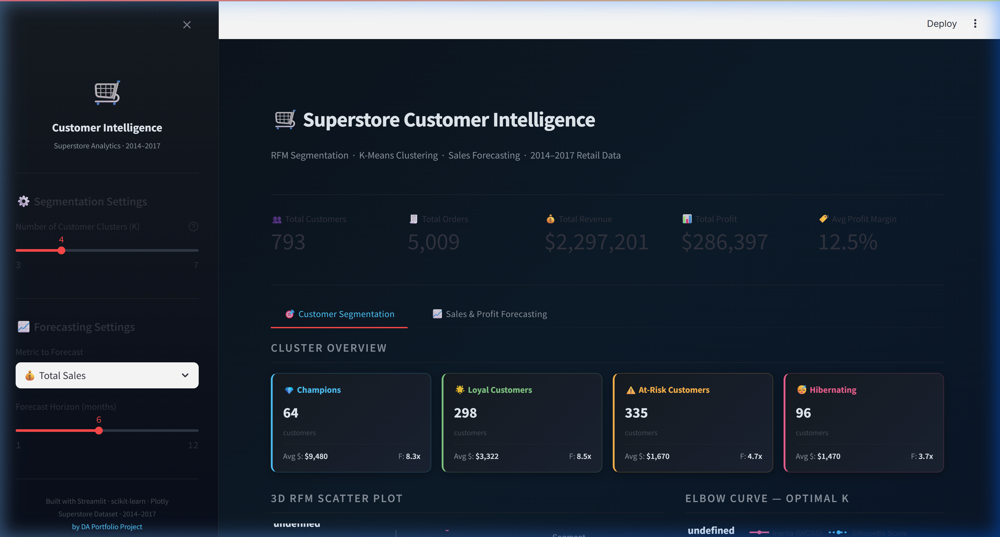
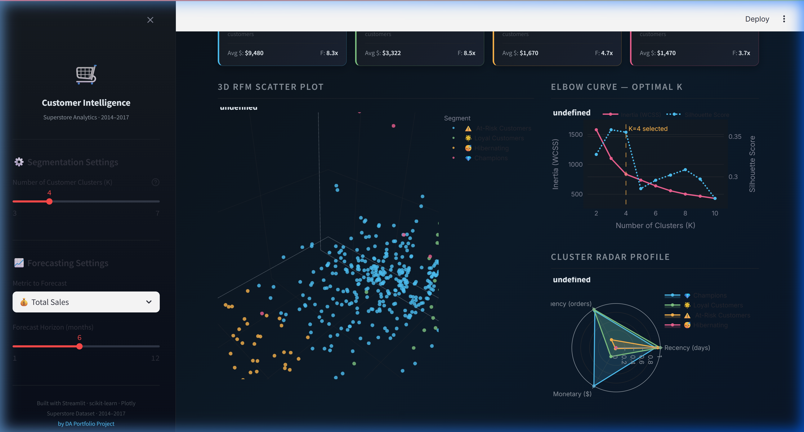
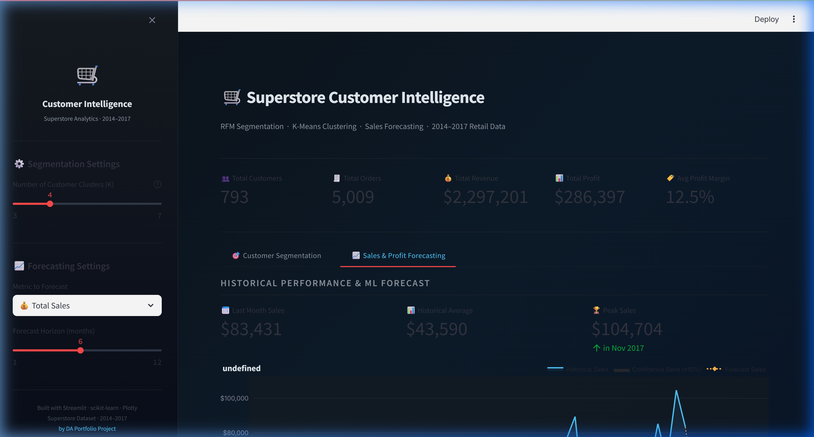
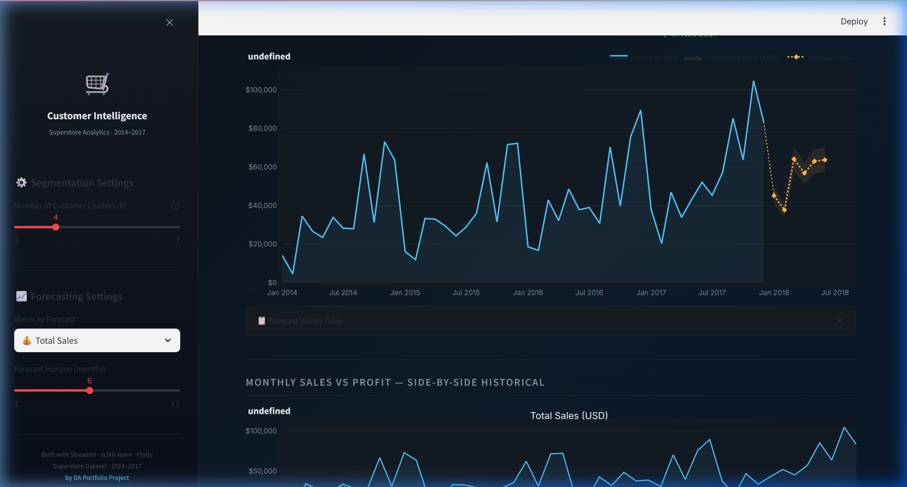

# 🛒 Superstore Customer Intelligence Dashboard

<div align="center">

**An end-to-end Machine Learning & Analytics web application** built with Python & Streamlit.  
Combines **RFM Customer Segmentation** (K-Means Clustering) with **Sales Forecasting** (Holt-Winters) on 4 years of Superstore transactional data.

[](https://share.streamlit.io)


</div>

---

## 📸 App Screenshots

### 🎯 Tab 1 — Customer Segmentation (RFM + K-Means)

**Overview: Global KPIs + Cluster Cards**


**3D RFM Scatter Plot · Elbow Curve · Radar Profile**


---

### 📈 Tab 2 — Sales & Profit Forecasting (Holt-Winters)

**Forecast KPIs + Historical vs Predicted Chart**


**Historical Sales & Profit Dual-Chart**


---

## 📌 Project Overview

This project demonstrates a **complete end-to-end Data Analyst workflow** on the **Superstore Sales Dataset (2014–2017)**:

| Module | Technique | Key Output |
|---|---|---|
| **Customer Segmentation** | RFM Feature Engineering + K-Means Clustering | Customer segment labels, 3D scatter, Radar profile, Revenue breakdown |
| **Sales Forecasting** | Holt-Winters Exponential Smoothing | 6–12 month Sales & Profit forecast with confidence bands |

> **Dataset size**: ~9,994 raw transactions · 793 unique customers · 4 years · 3 regions

---

## ✨ Features

| Feature | Description |
|---|---|
| **RFM Segmentation** | Auto-classify 793 customers into 3–7 groups based on recency, frequency, and spending |
| **K-Means + Elbow Curve** | Real-time slider to change K; backed by WCSS & Silhouette Score optimization |
| **3D Interactive Scatter** | Plotly-powered 3D visualization with per-customer hover tooltips |
| **Radar Profile Chart** | Normalized RFM radar chart per segment for business storytelling |
| **Holt-Winters Forecasting** | Seasonal time-series model predicting up to 12 months ahead |
| **Confidence Bands** | ±10% upper/lower bounds displayed on forecast chart |
| **Customer Search Table** | Filter by segment, search by name, view full RFM score per customer |
| **Dark Theme UI** | Premium dark UI built with custom CSS + Plotly dark styling |

---

## 🗂️ Project Structure

```
├── app.py                          # 🚀 Streamlit entry-point (2-tab dashboard)
├── rfm_clustering.py               # 🧠 RFM + K-Means + Holt-Winters logic
├── requirements.txt                # 📦 Python dependencies
├── .streamlit/
│   └── config.toml                 # 🎨 Dark theme configuration
├── data/
│   ├── raw/
│   │   └── superstore_raw.csv      # 📊 Raw transactions (~9,994 rows)
│   └── processed/
│       └── monthly_aggregation.csv # 📅 Pre-aggregated monthly time-series
├── assets/
│   └── screenshots/                # 🖼️ App screenshots (used in README)
│       ├── tab1_top.png
│       ├── tab1_bottom.png
│       ├── tab2_top.png
│       └── tab2_bottom.png
└── notebooks/                      # 📓 EDA & cleaning notebooks
```

---

## 🚀 Quick Start (Run Locally)

```bash
# 1. Clone the repository
git clone https://github.com/baoquocnguyn148/Customer-Segmentation-Analysis.git
cd Customer-Segmentation-Analysis

# 2. Create and activate virtual environment
python -m venv .venv
.venv\Scripts\activate        # Windows
# source .venv/bin/activate   # macOS / Linux

# 3. Install all dependencies
pip install -r requirements.txt

# 4. Launch the dashboard
streamlit run app.py
```

> The app will open at **http://localhost:8501** 🎉

---

## 🧠 Machine Learning Methodology

### Step 1 — RFM Feature Engineering
For each unique `Customer ID` in the raw transaction data:

| Feature | Definition | Business Meaning |
|---|---|---|
| **Recency (R)** | Days since last purchase date | How recently did the customer buy? Lower = more engaged |
| **Frequency (F)** | Count of unique orders | How often do they buy? Higher = more loyal |
| **Monetary (M)** | Total USD revenue generated | How much do they spend? Higher = more valuable |

### Step 2 — K-Means Clustering
1. Features are standardized with `StandardScaler` to remove scale bias.
2. **Elbow Method (WCSS)** and **Silhouette Score** are computed for K = 2 to 10.
3. K-Means++ is applied with the user-selected K (default: 4).
4. Clusters are ranked by mean Monetary value for consistent, intuitive labeling.

**Resulting segments** (with K=4):
| Segment | Customers | Avg Revenue | Behavior |
|---|---|---|---|
| 💎 Champions | 64 | $9,480 | Recent, frequent, high-value buyers |
| 🌟 Loyal Customers | 298 | $3,322 | Regular buyers, moderate spend |
| ⚠️ At-Risk Customers | 335 | $1,670 | Haven't purchased recently |
| 😴 Hibernating | 96 | $1,470 | Low frequency, low spend, long inactive |

### Step 3 — Sales & Profit Forecasting
- Applies **Holt-Winters Exponential Smoothing** with:
  - Additive trend component
  - Additive seasonality (period = 12 months)
  - MLE-optimized smoothing parameters
- Forecast horizon: configurable 1–12 months
- Visual confidence band: ±10% around point forecast

---

## 📊 Dataset

| Field | Detail |
|---|---|
| **Source** | [Kaggle — Superstore Sales Dataset](https://www.kaggle.com/datasets/vivek468/superstore-dataset-final) |
| **Period** | January 2014 — December 2017 |
| **Records** | 9,994 order-level rows |
| **Key Columns** | `Order ID`, `Customer ID`, `Segment`, `Region`, `Sales`, `Profit`, `Discount`, `Order Date` |
| **File encoding** | `latin-1` (handled automatically) |

---

## 🌐 Deploy to Streamlit Cloud (Free)

Turn this project into a **public portfolio URL** in under 5 minutes:

1. Push this repo to your GitHub account.
2. Go to **[share.streamlit.io](https://share.streamlit.io)** → Sign in with GitHub.
3. Click **"New app"** → Select this repository.
4. Set **Main file path**: `app.py`
5. Click **Deploy** → Get a public URL like:
   `https://baoquocnguyn148-customer-seg.streamlit.app`

---

## 🛠️ Tech Stack

| Library | Version | Purpose |
|---|---|---|
| `streamlit` | ≥ 1.35 | Web application framework |
| `scikit-learn` | ≥ 1.3 | K-Means, StandardScaler, Silhouette Score |
| `statsmodels` | ≥ 0.14 | Holt-Winters Exponential Smoothing |
| `plotly` | ≥ 5.15 | 3D Scatter, dual-axis charts, Radar, Pie |
| `pandas` | ≥ 2.0 | Data wrangling & RFM computation |
| `numpy` | ≥ 1.24 | Numerical operations |

---

## 👤 Author

**Bao Quoc Nguyen**  
Data Analyst · Portfolio Project

[](https://github.com/baoquocnguyn148)

---

*Built to demonstrate end-to-end Machine Learning, business analytics, and production-ready data visualization skills.*
